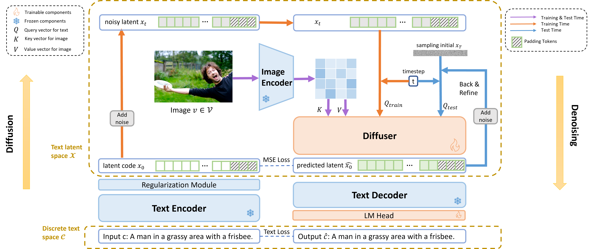
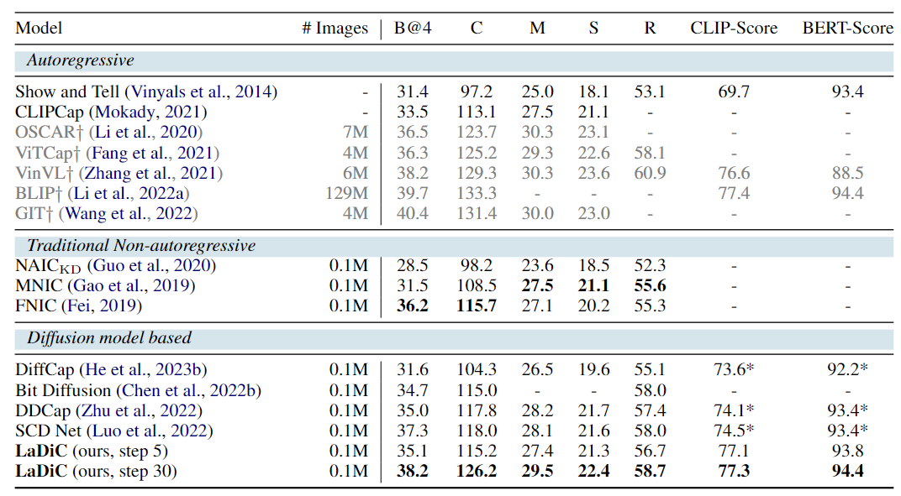
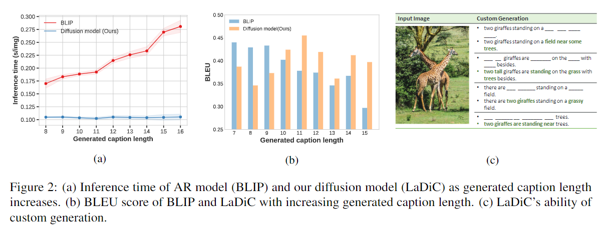

# LaDiC: Are Diffusion Models Really Inferior to Autoregressive Counterparts for Image-to-text Generation?

This the repo for offical implementation for NAACL 2024 paper: LaDiC: Are Diffusion Models Really Inferior to Autoregressive Counterparts for Image-to-text Generation?

## Introduction

Diffusion models have demonstrated remarkable capabilities in text-to-image generation. However, their performance in image-to-text generation, specifically image captioning, has trailed behind Auto-Regressive (AR) models, casting doubts on their suitability for such tasks. In this work, we reexamine diffusion models, highlighting their capacity for holistic context modeling and parallel decoding. These advantages address the inherent limitations of AR methods, such as slow inference speed, error propagation, and unidirectional constraints. Additionally, We identify the lack of an effective latent space for image-text alignment and the discordance between continuous diffusion processes and discrete textual data in previous works limit their performance. In response, we introduce a novel architecture, LaDiC, featuring a split BERT to create a dedicated latent space for captions and a regularization module to manage varying text lengths. Our framework further incorporates a diffuser for semantic image-to-text conversion and a Back&Refine technique to enhance token interactivity during inference. LaDiC achieves state-of-the-art performance for diffusion-based methods on the MS COCO dataset with a BLEU@4 score of 38.2 and a CIDEr score of 126.2, demonstrating exceptional performance without pretraining or ancillary modules. This indicates strong competitiveness with  AR models, revealing the previously untapped potential of diffusion models in image-to-text generation.

## Method

<div align=center>

</div>

An overview of our LaDiC model. It mainly consists of Text Encoder, Diffuser, and Text Decoder. On the left is the diffusion process, and on the right is the denoising process. Initially, the sentence $c$ is converted into a text latent space $\mathcal{X}$ by the text encoder. Subsequently, diffusion is performed on the text latent space, wherein a diffuser is trained to denoise noisy text latent representations $x_t$. Finally, the predicted text latent representation $\hat{x}_0$ without noise is passed through a NAR text decoder to generate the final sentence $\hat{c}$.

## Experimental Results

<div align=center>

</div>

Comparison results on COCO dataset, where B@4, M, R, C denote BLEU@4, METEOR, ROUGE-L, CIDEr and SPICE scores. $\dag$ 
 indicates pretrained models and we gray them out. * represents results of models trained by ourselves. For a fair comparison, all models will not incorporate  results by CIDEr optimization. Additionally, for reference, the inference time measured on an A100 GPU for inference step 5 is 0.020 s/img and step 10 is 0.105 s/img. We can see that our model achieves state-of-the-art performance across various metrics for both diffusion-based and traditional NAR models, and exhibits comparable performance with some well-established pretraining auto-regressive frameworks, despite being trained on significantly less data.

<div align=center>

</div>

Apart from achieving exceptional performance, we seek to emphasize the unique advantages of diffusion-based models over Autoregressive (AR) methods. Comparing the inference latency, BLEU score, and generation approach with BLIP as shown above, we observe the superiority of our model in:

- Parallel Token Emission: Diffusion-based model emits all tokens in parallel, effectively reducing the inference latency compared to autoregressive models, particularly as the length of the caption increases.

- Holistic Context Consideration: Diffusion model takes into account a more comprehensive context, thereby helping to alleviate the error accumulation issues inherent in autoregressive models.

- Flexible Generation Approach: In contrast to the unidirectional generation approach of AR models, the diffusion model adopts a more flexible manner of generation.
## Environment

Required packages and dependencies are listed in the `ladic.yaml` file. You can install the environment using Conda with the following command:

```bash
conda env create -f ladic.yaml
```

We also provide docker image as follows:

```bash
docker pull wangyuchi/diffcap:python3.8
```

## Datasets

We test on the COCO dataset. You can download [MSCOCO dataset](https://cocodataset.org/#download) and place it into `datasets` folder.

Meanwhile, we follow Karpathy split, and its annotation files can be found in its [orginial paper](https://cs.stanford.edu/people/karpathy/deepimagesent/). Our code will also automatically download these files and you may find them in `datasets/` folder.

## Required pretrained models

In our LaDiC model, Text Encoder and Decoder are initialized from BERT-Base-uncased, which can be downloaded from [Huggingface](https://huggingface.co/bert-base-uncased).

As for image encoder, we utilized pretrained ViT in BLIP. You may download from [here](https://storage.googleapis.com/sfr-vision-language-research/BLIP/models/model_base_capfilt_large.pth) and put it into `pretrained_ckpt` folder. More information can be found in [BLIP&#39;s official repo](https://github.com/salesforce/BLIP).

## Accelerate Configuration

We use accelerate package developed by Huggingface.

Configure Accelerate by using the following command in the command line:

```bash
accelerate config
```

Answer the questions based on your actual setup. You will be prompted to specify the GPU to use, and other configurations can be left as default. For more information, refer to [this link](https://huggingface.co/docs/accelerate/v0.13.2/en/quicktour#launching-your-distributed-script).

## Training

Launch the `main.py` script using Accelerate with the following command:

```bash
accelerate launch main.py [--args]
```

We list some important optional parameters as follows. The `notes` parameter is both a note to be placed at the top of the filename and the running name for Wandb. More hyperparameters and their description can be found in `configs/`

```bash
parser.add_argument('--notes', type=str, default=None, help='Note to be included in the trial name')
parser.add_argument('--bsz', type=int, default=5, help='batch size')
parser.add_argument('--seqlen', type=int, default=80, help='sequence length')
parser.add_argument('--epoch', type=int, default=10, help='epoch num')
parser.add_argument('--resume_epoch', type=int, default=0, help='start epoch of resume')
parser.add_argument('--resume_ckpt', type=str, default=None, help='resume or not')
parser.add_argument('--logdir', type=str, default='checkpoint', help='logdir')
```

## Evaluation

Specify `MODEL_NAME` and `RESULLT_FILE` in `coco_eval.py` representing checkpoint to be evaluated and output path respectively. Then you can run

```bash
python coco_eval.py
```

## TODO List
- [ ] Add more scripts for more flexible testing.
- [ ] Clean unrelated code.
- [ ] Provide pretraining checkpoint.
- [x] Provide training and testing code.
- [ ] Paper released on arXiv.

## Reference
 If you find our projects helpful to your research, please consider citing:
```
@article{
}
```

## Acknowledgements
Our code is heavily based on projects like [diffusion-image-captioning](https://github.com/xu-shitong/diffusion-image-captioning), [BLIP](https://github.com/salesforce/BLIP) and [Huggingface transformers](https://github.com/huggingface/transformers). Thanks for their splendid works!